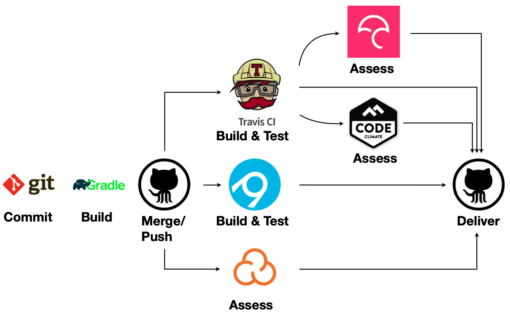

# Smake (Smart Snake or Snake-AI)

The main idea of this project is to prove that complicated Machine Learning methods 
and tools not always allow to reach a desired goal. 

The first part of this project is to build an application, which outputs a controllable 
snake game model (in different words a well-known snake game).

The second part is to connect an artificial player which will be simulated by
a simple NN or a simple mathematical model.

And the first part of the project was finished in terms of the small university project, 
the main idea of the pet project is to make acquaintance with some topics of Software engineering.

[//]:#


----

Travis-CI:

[](https://travis-ci.org/ElijahOzhmegov/Smake-Snake-AI-)

AppVeyor:

[](https://ci.appveyor.com/project/ElijahOzhmegov/smake-snake-ai)

CodeCov:

[](https://codecov.io/gh/ElijahOzhmegov/Smake-Snake-AI-)

CodeClimate:

[](https://codeclimate.com/github/ElijahOzhmegov/Smake-Snake-AI-/test_coverage)
<a href="https://codeclimate.com/github/ElijahOzhmegov/Smake-Snake-AI-/maintainability"></a>

Sonarcloud:

[](https://sonarcloud.io/dashboard?id=ElijahOzhmegov_Smake-Snake-AI-)

[](https://sonarcloud.io/dashboard?id=ElijahOzhmegov_Smake-Snake-AI-)
[](https://sonarcloud.io/dashboard?id=ElijahOzhmegov_Smake-Snake-AI-)
[](https://sonarcloud.io/dashboard?id=ElijahOzhmegov_Smake-Snake-AI-)


[](https://sonarcloud.io/dashboard?id=ElijahOzhmegov_Smake-Snake-AI-)
[](https://sonarcloud.io/dashboard?id=ElijahOzhmegov_Smake-Snake-AI-)
[](https://sonarcloud.io/dashboard?id=ElijahOzhmegov_Smake-Snake-AI-)
[](https://sonarcloud.io/dashboard?id=ElijahOzhmegov_Smake-Snake-AI-)
## 1. UML
To create UML diagrams I used a PlantUML plugin in PyCharm.
### 1.1. Class Diagram
<p align="center">
  
</p>

### 1.2. Use Case diagram
<p align="center">
  
</p>

### 1.3. Activity diagram
<p align="center">
  
</p>

## 2. Metrics

Besides the badges at the beginning of the page,
you can find additional information about used metrics
on the following pages:
* [sonarcloud.io](https://sonarcloud.io/dashboard?id=ElijahOzhmegov_Smake-Snake-AI-) 
page 
* [codeclimate](https://codeclimate.com/github/ElijahOzhmegov/Smake-Snake-AI-) page
* [codecov.io](https://codecov.io/gh/ElijahOzhmegov/Smake-Snake-AI-) page


## 3. Clean Code Development
During development were used  **Clean Code Development** principles
and PEP Conventions.

1. [Method Names and Instance Variables](https://pep8.org/#method-names-and-instance-variables):
    Use the function naming rules: lowercase with words separated by underscores as necessary to improve readability.
    ```python
    def __get_pos_on_screen(self, snake_pos):
        return snake_pos * self.scale_coef + self.scale_coef // 2
    ```
2. [Class Names](https://pep8.org/#class-names):
    Class names should normally use the CapWords convention.
    ```python
    class Playground(object):
        ...
    class Food:
        ...
    class Direction:
        ...
    ```
3. Function rules: Small, Do one thing, Use descriptive names:
    ```python
    def get_body(self):
        return self.__body
   
    def get_body_list(self):
        return [segment.get_pos() for segment in self.get_body()]

    def get_speed(self):
        return self.__speed.dir

    def get_position(self):
        return self.__position.pos

    def get_allowed_space(self):
        return self.__pg.rows, self.__pg.rows

    def get_seen_food_pos(self):
        return self.__food.get_pos()
    ```
4. Source code structure: Similar function should be close
    ```python
    def __is_injuring_itself(self, new_position):
        segments = [segment.pos for segment in self.__body]
        if new_position.get_pos() in segments:
            return True
        return False

    def __is_colliding_wall(self, new_position):
        if new_position.get_pos() in self.__borders:
            return True
        return False

    def get_body(self):
        return self.__body

    def get_body_list(self):
        return [segment.get_pos() for segment in self.get_body()]

    def get_speed(self):
        return self.__speed.dir

    def get_position(self):
        return self.__position.pos

    def get_allowed_space(self):
        return self.__pg.rows, self.__pg.rows

    def get_seen_food_pos(self):
        return self.__food.get_pos()

    def turn(self, new_dir):
        new_speed = self.__speed + Direction(direc=new_dir)
        if any(new_speed) != 0:
            self.__speed = Direction(direc=new_dir)

    def move(self):
        new_position = self.__position + Position(self.__speed.get_dir())

        if self.__is_injuring_itself(new_position):
            return Snake.self_collision

        if self.__is_colliding_wall(new_position):
            return Snake.wall_collision

        self.__position = new_position
        self.__move_body()
    ```
5. [Maximum Line Length](https://pep8.org/#maximum-line-length):
    Limit all lines to a maximum of 79 characters.
    ```python
    pygame.draw.rect(self.screen, Window.GREEN,
                     (x_pos - self.scale_coef // 2,
                      y_pos - self.scale_coef // 2,
                      self.scale_coef, self.scale_coef))
    ```
   Interesting fact: Python does not have namespaces like C++ or
   Java, so I use Constants logically attached to the class 
   (`Window.GREEN`). PEP keeps silence in this case.
   
[CCD Cheatsheet](https://user-images.githubusercontent.com/35653122/51113192-86f8d880-1801-11e9-90ad-88dd58854a18.png)

## 4. Build Management with PyGradle and Gradle
The easiest way to use Build Management system with
Python is [PyGradle](https://github.com/innobead/pygradle).
It does the following things:
* installs environment, dependencies
* launches tests
* builds python wheel
* generates docs (html and xml)

In current project:
* [build.gradle](build.gradle) file has instructions to build.
* [gradle_report.txt](gradle_report.txt) file is an output example.

To have possibility to launch gradle even without IDE
I have made a simple [bash script](launch_gradle.sh), that
does this. 

## 5. Unit-Tests
Although, the project has GUI, it was not covered by
tests by understandable reasons. Only the snake model 
was covered. 
[test_snake_model.py](tests/the_game/backend/test_snake_model.py)

## 6. Continuous Integration
Unfortunately my project does not have delivery part at least 
standard one like PyPI or some Python-based website. 
So Let's assume I  deliver my project just on github 
with all green/yellow 
values of the badges. So that all of them were green or at 
least yellow for such badges as test coverage.

My Pipeline: 


First of all, Travis-CI is responsible for Linux and 
AppVeyer for Windows.

Travis-CI service after the unit tests sends 
reports to CodeClimate.com and codecov.io.
Details can be found in **travis.yml** file for 
Travis and in **appveyor.yml**, **tox.ini** for AppVeyor.

* [Travis-CI report](https://travis-ci.org/ElijahOzhmegov/Smake-Snake-AI-)
* [AppVeyor report](https://ci.appveyor.com/project/ElijahOzhmegov/smake-snake-ai)

Gradle report usually looks like on the picture below.


